# Chatify

This is a **Flutter-based messaging application** developed as a portfolio project. The app is designed with essential features for modern communication and showcases my skills in Flutter development.

---

## Features

- **Add Contacts**: Users can add new contacts to their contact list.
- **Send and Receive Messages**: Real-time messaging capabilities.
- **Create and Join Groups**: Users can create groups or join existing ones to chat with multiple people.
- **Authentication**:
    - Register new accounts.
    - Login with existing accounts.
- **Profile Picture Selection**: Choose a profile picture directly from the gallery.
- **Real-time Communication**:
    - Implemented using **Socket.io** for seamless interactions.
- **Storage**:
    - **Hive** for structured local storage.
    - **GetStorage** for lightweight key-value storage.

---

## Screenshots

Below are some screenshots to give an overview of the application:

1. **Home Screen**: Overview of recent chats and contacts.
2. **Contact Management**: Interface for adding and managing contacts.
3. **Group Chat Screen**: Real-time communication in groups.
4. **Authentication Pages**:
    - Registration Page.
    - Login Page.
5. **Chat Screen**: Real-time messaging interface.
6. **Profile Management**: Setting and updating profile picture and information.

<div style="display: flex; flex-wrap: wrap; justify-content: space-between;">
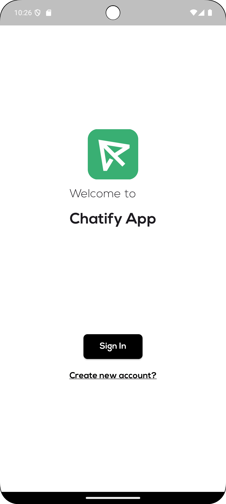
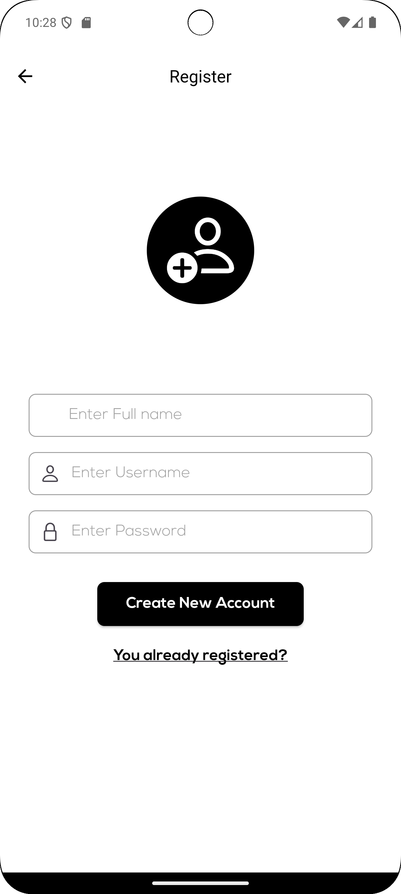
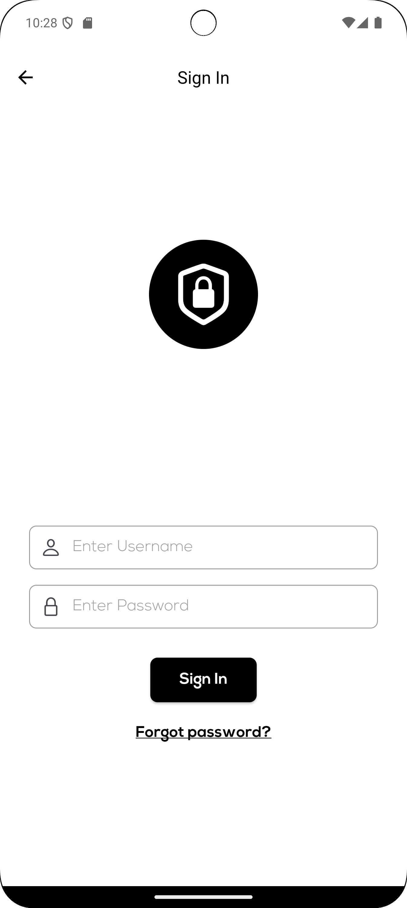
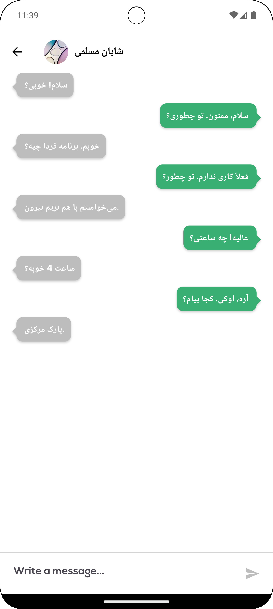
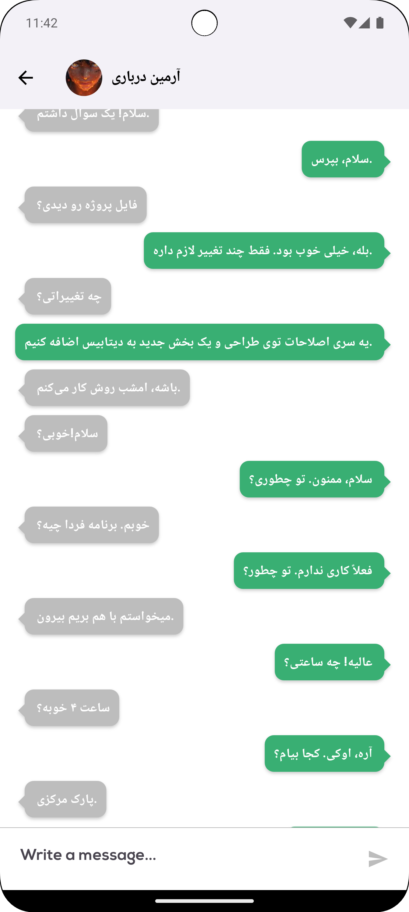
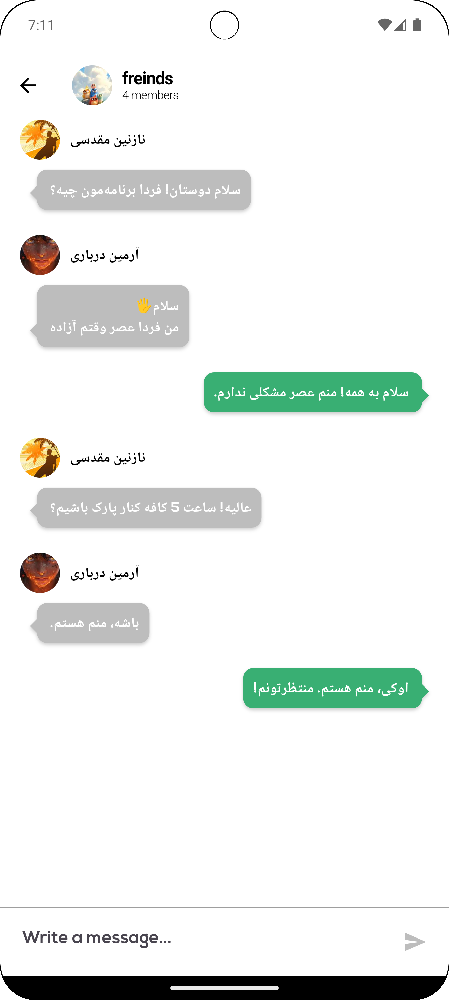
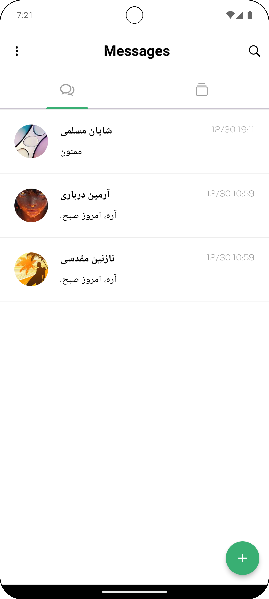
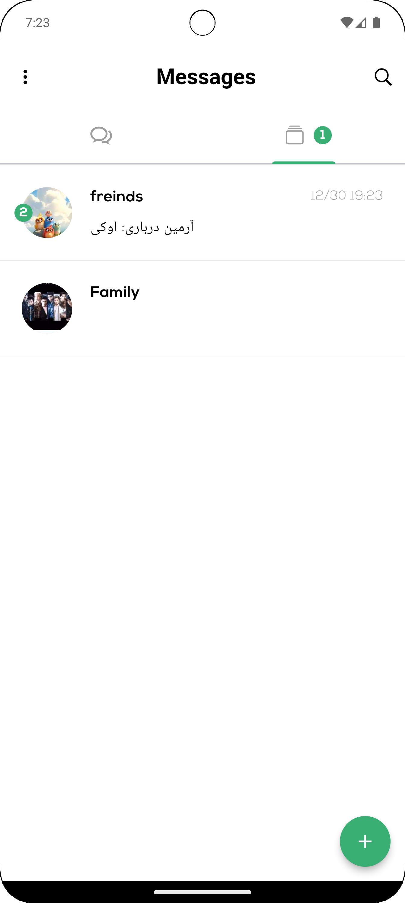
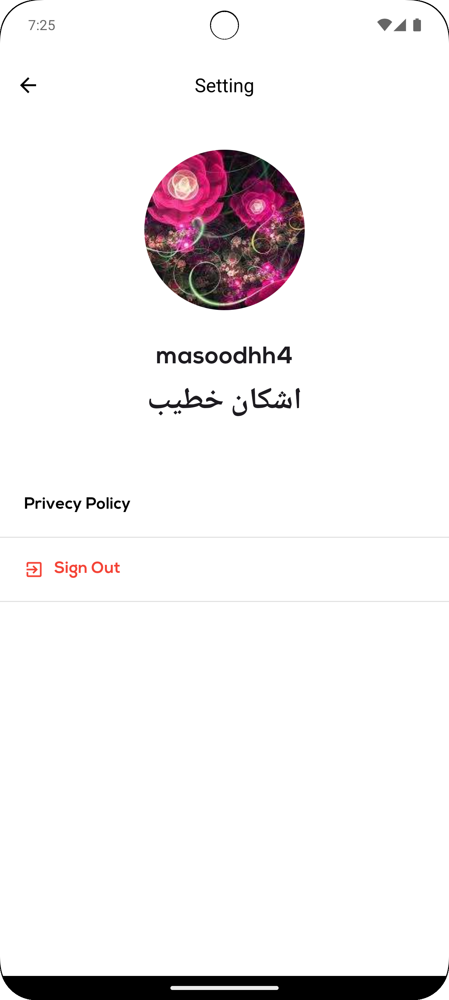
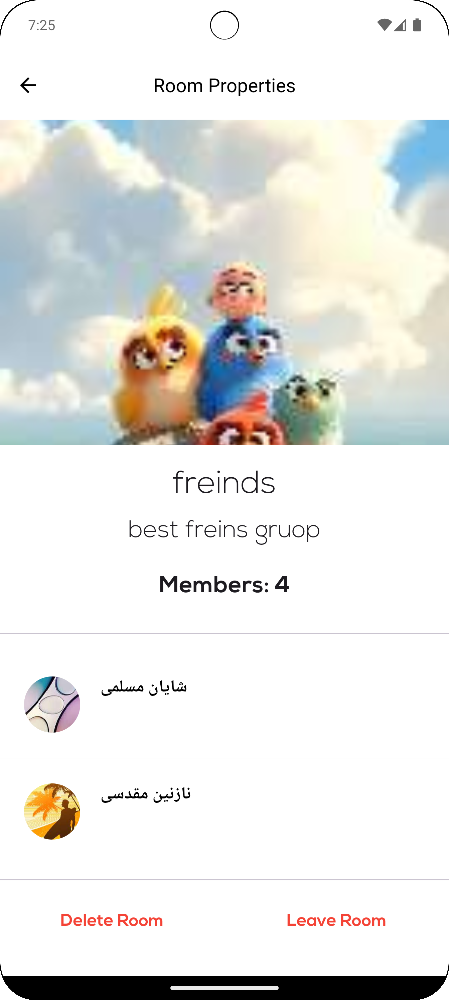
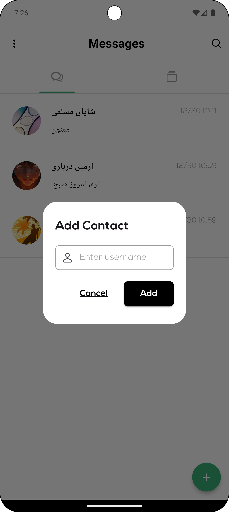
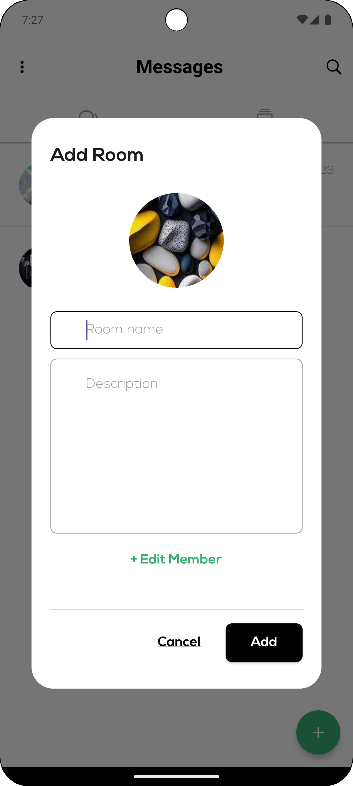
</div>
---

## Installation

1. Clone the repository:

   ```bash
   git clone https://github.com/masoodhh/chattify.git
   ```

2. Navigate to the project directory:

   ```bash
   cd chattify
   ```

3. Install dependencies:

   ```bash
   flutter pub get
   ```

4. Run the app:

   ```bash
   flutter run
   ```

---

## Technical Stack

- **Frontend**: Flutter (Dart)
- **Storage**:
    - **Hive**: For local database management.
    - **GetStorage**: Lightweight local storage.
- **Real-time Communication**: Socket.io

---

## Future Improvements

- Add push notification support.
- Enhance UI/UX for better user experience.
- Add support for media sharing (images, videos, etc.).
- Implement end-to-end encryption for messages.

---

## Contributions

Contributions are welcome! Feel free to open issues or submit pull requests for new features, bug fixes, or documentation improvements.

---

## License

This project is licensed under the MIT License. See the `LICENSE` file for details.

---

## Contact

For any inquiries or feedback, reach out to me at:

- Email: masoodyarab2@gmail.com
- GitHub: [masoodhh](https://github.com/masoodhh)
- LinkedIn: [Masood Hasanzadeh](https://www.linkedin.com/in/masood-hasanzadeh)

---

<div dir="rtl" align="right">

## Chatify

این یک **برنامه پیامرسان مبتنی بر Flutter** است که به‌عنوان یک پروژه نمونه کار طراحی شده است. این برنامه با ویژگی‌های ضروری برای ارتباطات مدرن طراحی شده و مهارت‌های من در توسعه فلاتر را نشان می‌دهد.

---

## ویژگی‌ها

- **افزودن مخاطب**: کاربران می‌توانند مخاطبین جدید به لیست خود اضافه کنند.
- **ارسال و دریافت پیام**: قابلیت پیام‌رسانی در زمان واقعی.
- **ساخت و پیوستن به گروه‌ها**: کاربران می‌توانند گروه ایجاد کنند یا به گروه‌های موجود بپیوندند.
- **احراز هویت**:
    - ثبت‌نام حساب‌های جدید.
    - ورود به حساب‌های موجود.
- **انتخاب عکس پروفایل**: انتخاب عکس پروفایل به‌طور مستقیم از گالری.
- **ارتباطات در زمان واقعی**:
    - پیاده‌سازی شده با **Socket.io** برای تعامل بدون نقص.
- **ذخیره‌سازی**:
    - از **Hive** برای مدیریت پایگاه داده محلی ساختاریافته.
    - از **GetStorage** برای ذخیره‌سازی سبک کلید-مقدار.

---

## اسکرین‌شات‌ها

در ادامه چند اسکرین‌شات برای آشنایی با برنامه ارائه شده است:

1. **صفحه اصلی**: نمایی از چت‌ها و مخاطبین اخیر.
2. **مدیریت مخاطبین**: رابطی برای افزودن و مدیریت مخاطبین.
3. **صفحه چت گروهی**: ارتباط در زمان واقعی در گروه‌ها.
4. **صفحات احراز هویت**:
    - صفحه ثبت‌نام.
    - صفحه ورود.
5. **صفحه چت**: رابط پیام‌رسانی در زمان واقعی.
6. **مدیریت پروفایل**: تنظیم و به‌روزرسانی عکس و اطلاعات پروفایل.

<div style="display: flex; flex-wrap: wrap; justify-content: space-between;">


</div>

---

## نصب

1. کلون کردن ریپازیتوری:

   ```bash
   git clone https://github.com/masoodhh/chattify.git
   ```

2. به دایرکتوری پروژه بروید:

   ```bash
   cd chattify
   ```

3. وابستگی‌ها را نصب کنید:

   ```bash
   flutter pub get
   ```

4. برنامه را اجرا کنید:

   ```bash
   flutter run
   ```

---

## تکنولوژی‌های استفاده شده

- **فرانت‌اند**: Flutter (Dart)
- **ذخیره‌سازی**:
    - **Hive**: برای مدیریت پایگاه داده محلی.
    - **GetStorage**: ذخیره‌سازی سبک کلید-مقدار.
- **ارتباط در زمان واقعی**: Socket.io

---

## بهبودهای آینده

- افزودن پشتیبانی از اعلان‌های پوش.
- بهبود رابط کاربری/تجربه کاربری برای تجربه بهتر کاربران.
- افزودن پشتیبانی از اشتراک‌گذاری رسانه (تصاویر، ویدیوها و ...).
- پیاده‌سازی رمزنگاری پایان به پایان برای پیام‌ها.

---

## مشارکت‌ها

مشارکت‌ها استقبال می‌شود! می‌توانید برای ویژگی‌های جدید، رفع باگ یا بهبود مستندات درخواست ارسال کنید یا مسائل را باز کنید.

---

## مجوز

این پروژه تحت مجوز MIT منتشر شده است. فایل `LICENSE` را برای جزئیات ببینید.

---

## تماس

برای هرگونه سوال یا بازخورد، با من در ارتباط باشید:

- ایمیل: masoodyarab2@gmail.com
- گیت‌هاب: [masoodhh](https://github.com/masoodhh)
- لینکدین: [Masood Hasanzadeh](https://www.linkedin.com/in/masood-hasanzadeh)

</div>

